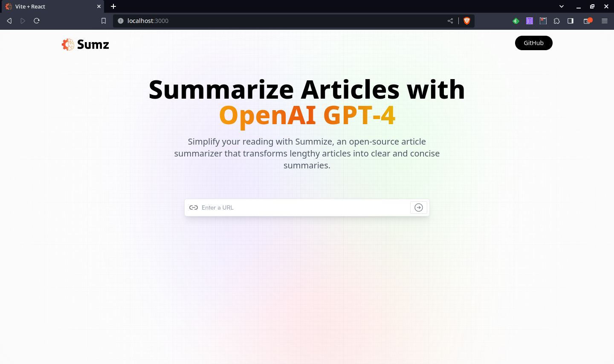

# AI-Summarizer

The ai-summarizer application is a tool that generates automatic summaries from any URL provided as a parameter. With this application, users can quickly and efficiently obtain concise summaries of web content, making it easy to understand and evaluate relevant information without having to review the entire content.

## Table of Contents

- [Technologies](#technologies)
- [Getting Started](#getting-started)
  - [Running Locally](#running-locally)
- [Docker](#docker)
  - [Building the Docker Image](#building-the-docker-image)
  - [Running the Docker Container](#running-the-docker-container)
- [Screenshot](#screenshot)
- [License](#license)

## Technologies

- [Vite](https://vitejs.dev/)
- [React](https://reactjs.org/)
- [TypeScript](https://www.typescriptlang.org/)
- [Tailwind CSS](https://tailwindcss.com/)
- [Docker](https://www.docker.com/)

## Getting Started

### Running Locally

1. Clone the repository:
  `git clone https://github.com/gcharalla/ai-summarizer.git`
2. Execute:
  `npm install`
3. Then modify the .env file with your credentials
4. Now execute:
  `npm run dev`

## Docker

### Building the Docker Image

1. Make sure to modify the .env file with your credentials.
2. Then build the image: 
  `docker build -t ai-summarizer .`

### Running the Docker Container

1. Execute:
  `docker run -p 3000:3000 -d ai-summarizer`
2. To change the port modify the vite.config.js file, then rebuild the image as indicated in the previous section.

## Screenshot

## License

This project is licensed under the MIT License. See the LICENSE file for more details.
